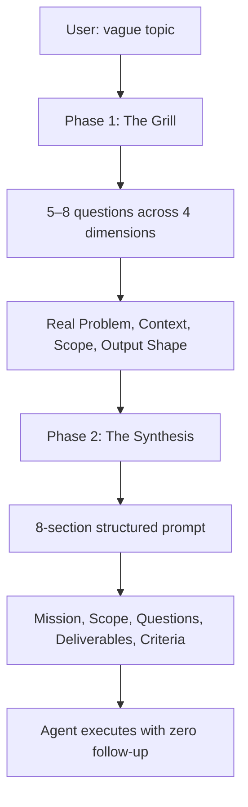

# 🔬 Deep Research Prompt

> **Grill first. Write second. Research actually works.**
>
> A Claude skill that interrogates you with 5–8 sharp questions, then synthesizes a production-ready research prompt your AI agent swarm can execute autonomously.

[](https://opensource.org/licenses/MIT)
[](https://claude.ai)
[](https://www.npmjs.com/package/deep-research-prompt)

Most research prompts are **vague wishes dressed as instructions**. You write *"research how to build X"* and the AI gives you a generic overview that misses your stack, constraints, and decision context.

**This skill fixes that.**

It grills you first — *GrillMe style* — extracts the real context, then synthesizes a structured research prompt that an AI agent can execute with **zero follow-up questions**.

```bash
npx deep-research-prompt skills add
```

Then open your AI assistant and say:

```
@deep-research-prompt research Firecracker vs Docker for sandbox isolation
```

**Every prompt shows its reasoning.** No black-box outputs. No "let me know if you need anything else."

---

## 🔥 Why Deep Research Prompt?

Most AI "research" today is **a Google search in a trench coat**: dump a vague query, get a generic overview, pray it answers your actual question. That fails when you need to:

- Evaluate technologies against **your actual stack and constraints**
- Make a **specific decision** (not just "learn about X")
- Get output an **agent can execute** without asking you 20 follow-ups
- Prevent **scope creep** with explicit in/out boundaries

Deep Research Prompt treats research briefing as a **structured interrogation**, not a creative writing exercise.

| Capability | Typical AI Prompt | Deep Research Prompt |
|---|---|---|
| **Input handling** | "Here's a topic, go research it" | 🔥 5–8 targeted questions across 4 dimensions |
| **Context extraction** | None — agent guesses | 🔥 Stack, timeline, budget, prior attempts, anti-scope |
| **Output structure** | Wall of text | 🔥 8-section template: mission, scope, questions, deliverables, criteria |
| **Actionability** | "Let me know what you think" | 🔥 Agent-ready — no further clarification needed |
| **Scope control** | Creep city | 🔥 Explicit in-scope / out-of-scope sections |
| **Decision support** | Overview | 🔥 Research questions tied to specific decisions |
| **Explainability** | Black box generation | 🔥 Every section traces back to grill answers |

---

## 🧠 How It Works

Deep Research Prompt implements a **two-phase interrogation pipeline**:



### The Four Grill Dimensions

| Dimension | What It Extracts | Example Question |
|---|---|---|
| 🔥 **Real Problem** | The decision this research unblocks | "If the research came back perfect, what would you do next?" |
| ⚙️ **Context & Constraints** | Stack, timeline, budget, prior attempts | "What have you already tried or ruled out?" |
| 🎯 **Scope Control** | What's in AND out | "What should the research definitely NOT cover?" |
| 📄 **Output Shape** | Who reads it, what format, how deep | "Who is the primary reader — you, a team, or an AI agent?" |

### The 8-Section Output

Every synthesized prompt includes:

```
# Deep Research Prompt: [TITLE]

## Mission Statement          ← 1–2 sentences, specific
## Background & Context       ← Stack, constraints, prior attempts
## Research Scope             ← Explicit in-scope / out-of-scope
## Research Questions         ← 5+ questions, each with 2–3 sub-questions
## Deliverables Expected      ← Tables, code, comparisons — concrete
## Constraints to Respect     ← Timeline, budget, non-negotiables
## Success Criteria           ← Measurable completion conditions
## Suggested Research Approach ← How an agent should tackle it
```

---

## 🚀 One-Command Quick Start

```bash
npx deep-research-prompt install
```

Or install globally:

```bash
npm install -g deep-research-prompt
deep-research-prompt skills add
```

Then open your AI assistant and type:

```
@deep-research-prompt research Firecracker vs Docker for sandbox isolation
```

Or start with a vague idea:

```
I want to integrate a coding agent into my SaaS product
```

The skill will grill you, then output a structured prompt you can hand to any agent.

---

## 🛠️ Platform Support

Register the skill with your AI assistant:

| Platform | Install Command |
|---|---|
| Claude Code | `deep-research-prompt skills add` |
| Codex | `deep-research-prompt skills add --platform codex` |
| OpenCode | `deep-research-prompt skills add --platform opencode` |
| Cursor | `deep-research-prompt skills add --platform cursor` |
| Kimi Code | `deep-research-prompt skills add --platform kimi` |
| Gemini CLI | `deep-research-prompt skills add --platform gemini` |
| Aider | `deep-research-prompt skills add --platform aider` |
| Trae | `deep-research-prompt skills add --platform trae` |
| Pi coding agent | `deep-research-prompt skills add --platform pi` |

### Claude.ai (Web)

1. Download [`skill/deep-research-prompt.skill`](./skill/deep-research-prompt.skill)
2. In Claude, go to **Settings → Skills → Install from file**

### Project-Scoped Install

Install into the current repo so your team gets it:

```bash
deep-research-prompt skills add --project
```

This writes to `.claude/skills/deep-research-prompt/SKILL.md` (or equivalent for your platform).

### Install the `.skill` ZIP

For platforms that prefer the packaged skill:

```bash
deep-research-prompt skills add --platform claude --zip
```

---

## 📋 Command Reference

| Command | Description |
|---|---|
| `deep-research-prompt skills add` | Add skill for Claude Code (default) |
| `deep-research-prompt skills add --platform <name>` | Add for a specific platform |
| `deep-research-prompt skills add --project` | Add into current project only |
| `deep-research-prompt skills add --zip` | Add the `.skill` ZIP file |
| `deep-research-prompt skills remove` | Remove from default platform |
| `deep-research-prompt skills remove --platform <name>` | Remove from specific platform |
| `deep-research-prompt list` | List all supported platforms |
| `deep-research-prompt --version` | Show version |
| `deep-research-prompt --help` | Show help |

---

## 💡 Usage Triggers

The skill fires automatically when you say things like:

- *"Help me research X"*
- *"I want to investigate Y"*
- *"Create a research prompt for Z"*
- *"Deep research on..."*
- *"I'm evaluating whether to use..."*
- *"I have this vague idea and need to figure out..."*

Or explicitly:

```
@deep-research-prompt research Firecracker vs Docker for sandbox isolation
```

---

## 📚 Examples

| Example | Topic |
|---------|-------|
| [Pi SDK Integration](examples/pi-sdk-integration.md) | Integrating Pi SDK headless into a SaaS product |
| [Forking a Coding Agent](examples/fork-coding-agent.md) | Forking Pi into a private branded tool |

> Want to add your own? Run the skill on a real topic, save the output, and open a PR. See [CONTRIBUTING.md](CONTRIBUTING.md).

### Quick Example Walkthrough

**User:** *"I want to research using Pi SDK as a coding agent inside my product"*

**Skill grills:**

> 1. What does your product do and what's the tech stack?  
> 2. What will the agent do — generate code, review it, both?  
> 3. Do you need headless (no TUI) or interactive mode?  
> 4. What's your deployment target — Docker, cloud, local?  
> 5. What's the timeline and are you building this solo?  
> 6. What have you already tried or ruled out?  
> 7. What decision does this research need to unlock?

**Skill outputs:** → [See full example](examples/pi-sdk-integration.md)

---

## ✅ Quality Checklist

Every output is verified against this checklist before presentation:

- [ ] Mission statement is 1–2 sentences, not vague
- [ ] At least 5 research questions, each with 2–3 sub-questions
- [ ] Out-of-scope section is filled (prevents scope creep)
- [ ] Deliverables are concrete (tables, code, comparisons)
- [ ] Success criteria are measurable
- [ ] Prompt is actionable by an AI agent with no further clarification

---

## 🤝 Contributing

```bash
git clone https://github.com/KJ-AIML/deep-research-prompt.git
cd deep-research-prompt
```

**Top contribution ideas:**

- 📝 **New example outputs** — run the skill on a real topic, share the result
- 🔥 **Better grill questions** — suggest additions for specific domains (security, hiring, market research)
- 📦 **Domain-specific templates** — add `references/` folders for specialized research
- 🌍 **Translations** — help localize the skill

See [CONTRIBUTING.md](CONTRIBUTING.md) for details.

---

## 📄 License

MIT © 2026 deep-research-prompt Contributors
